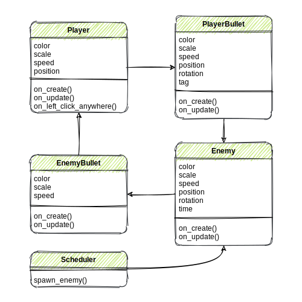

<link rel="stylesheet" type="text/css" media="all" href="style.css" />

# Markdown Notes

You will use the Markdown language to generate the contents of your webpage. We have already seen some Markdown in Jupyter text cells. Below is an overview of Markdown and some examples you can use to add content to your page.

## Headings

``` markdown
# Title Heading
## Section Heading
### Subsection Heading
#### Subsubsection Heading
```

will be displayed like this:

# Title Heading
## Section Heading
### Subsection Heading
#### Subsubsection Heading

---

## Images

``` markdown

```
will be displayed like this


---
## Lists

``` markdown
- unordered item 1
- unordered item 2
- unordered item 3

1. ordered item 1
2. ordered item 2
3. ordered item 3
```

will be displayed like this:

- unordered item 1
- unordered item 2
- unordered item 3

1. ordered item 1
2. ordered item 2
3. ordered item 3

---
## Links

``` markdown
go back to [home](index.md)
```

will be displayed like this:

go back to [home](index.md)

---

## Code Blocks

<pre>
``` python
class Sprite:
    def __init__(self):
        self.x = 0
        self.y = 0
```
</pre>

will be displayed like this:

``` python
class Sprite:
    def __init__(self):
        self.x = 0
        self.y = 0
```

---

## HTML

### Video

### Image Size

---

## CSS

### Background Color

### Text Fonts

### Custom Classes